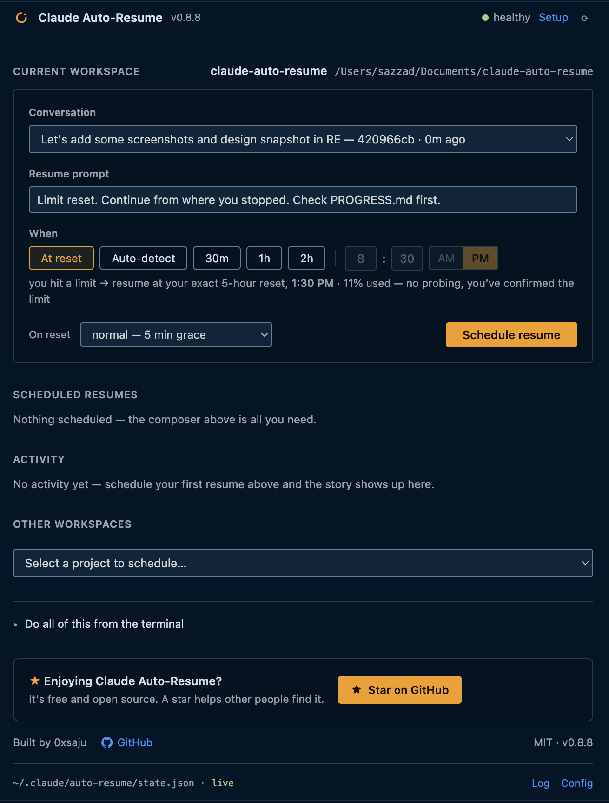
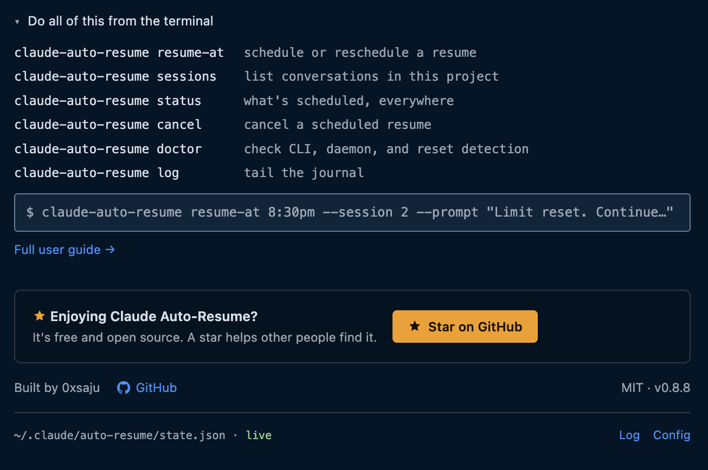
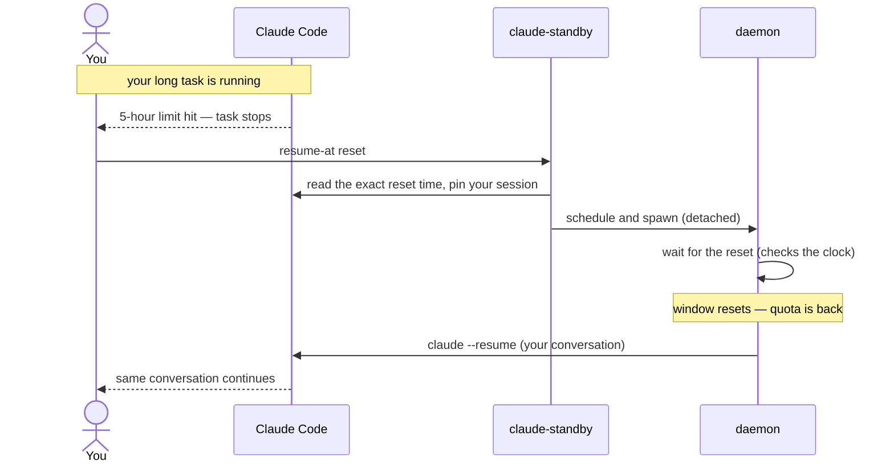

<div align="center">

# claude-standby

**Your Claude Code task hit a usage limit at 2 AM. It finished anyway.**

Auto-resume for Claude Code: detects when the limit lifts, resumes your
session with context, and never makes you babysit a terminal again.


[](https://marketplace.visualstudio.com/items?itemName=0xsaju.claude-standby-cockpit)
[](https://open-vsx.org/extension/0xsaju/claude-standby-cockpit)

[Install](#installation) · [Quick start](#quick-start) ·
[Commands](#commands) · [How it works](#how-it-works) ·
[Docs](#documentation) · [Contributing](#contributing)

</div>

---

```text
$ claude
  … ✗ You've hit your session limit · resets 4:10pm (Asia/Dhaka)

$ claude-standby resume-at
  Resume scheduled.
    workspace  : ~/projects/my-app
    resume at  : auto-detect (probing every 30 min until the limit lifts)
    session    : 612fb08b — the original conversation continues (claude --resume)
    importance : critical
    daemon     : running detached, wakes every 60s

$ # …close the laptop lid. Walk away.
  # At reset: desktop notification → YOUR session picks up where it stopped.
```

## Screenshots

The VS Code cockpit (it follows your editor theme):



Everything in the panel maps 1:1 to a CLI command — the reference is built in:



## Why

Long agentic tasks regularly outlive a usage window. When the limit hits,
the session dies mid-task — and you check back every twenty minutes so you
can type "continue" the moment it resets. That's an alarm clock job, not a
developer job. claude-standby takes the shift for you: one command
after the limit hits (soon: zero commands), and the task resumes itself
the moment resuming is possible.

## Features

| | |
|---|---|
| **True session resume** | The interrupted **conversation itself** continues (`claude --resume <session-id>`) — not a fresh chat. The newest session is pinned automatically; `claude-standby sessions` lists them, `--session` picks another, and the VS Code cockpit shows them as one-click plates. |
| **Exact reset detection** | Auto mode reads your live reset time from Claude Code's own usage data and schedules the resume for that **exact** moment — no polling, no quota. Works with zero setup when your status line already caches it (or `setup-statusline` to add a tiny sensor); falls back to a single limit-message probe when no local data exists. |
| **Works when nothing else does** | The CLI costs zero tokens and needs no model turn — it works *while you're rate-limited*, which is precisely when you need it. |
| **Importance tiers** | `critical` resumes silently, `normal` gives you a 5-minute window to object, `low` only notifies. |
| **Suspend-safe** | The daemon compares wall-clock time on 60-second ticks — a closed lid delays nothing. |
| **Context-aware resume** | The resumed conversation already carries its full context (`claude --resume`), so it continues instead of starting over — no re-priming needed. Point a custom `--prompt` at a progress/handoff file for even more reliable pickups. |
| **Safety rails** | Bounded retries, backoff when a resume bounces off a still-active limit, instant cancel (kills in-flight work), no dangerous permission flags unless you opt in. |
| **Update-aware CLI** | Interactive `status` and `doctor` check for a new release at most once a day and print one actionable notice. No silent installs; no network calls from the daemon or sensor. |
| **Honest by design** | Detection is built from *measured* behavior, never guessed message formats. Weekly caps can't be beaten, and the docs say so. |

## Installation

One command — no root, no dependencies beyond bash (`jq` recommended,
`python3` used if present):

```sh
curl -fsSL https://raw.githubusercontent.com/0xsaju/claude-standby/main/install.sh | bash
```

This is the **complete** setup: the CLI lands on your PATH
(`~/.local/bin`) and the engine in `~/.claude-standby`. Nothing else to
configure — exact-reset detection works automatically if your status line
already caches your usage (otherwise `claude-standby setup-statusline`
adds a tiny sensor, opt-in).

The tool manages itself from then on:

```sh
claude-standby update       # get the latest version (download + swap)
claude-standby update --check # check without installing
claude-standby doctor       # verify the whole environment
claude-standby uninstall    # remove cleanly (keeps your task state)
```

> **Windows**: best-effort via WSL/Git Bash for now; native support
> (Task Scheduler) is on the roadmap.

### The cockpit (optional GUI)

A thin VS Code / Cursor panel over the same CLI — status bar, one-click
scheduling, and a dashboard. Install from your editor's Extensions view
(search **"Claude Standby"**), or directly:

- **VS Code** → **[Marketplace](https://marketplace.visualstudio.com/items?itemName=0xsaju.claude-standby-cockpit)**
- **Cursor / Windsurf / VSCodium** → **[Open VSX](https://open-vsx.org/extension/0xsaju/claude-standby-cockpit)**

On first run it offers to install the CLI above for you. The cockpit drives
the CLI; it never spawns or parses Claude Code itself.

## Quick start

The day a limit interrupts you:

```sh
cd ~/projects/my-app
claude-standby resume-at          # auto-detect the reset, resume, done
```

Prefer an exact time, or want to watch?

```sh
claude-standby resume-at 20:00    # resume precisely at 20:00
claude-standby status             # task state, attempts, journal
claude-standby watch              # follow the daemon log live
claude-standby cancel             # stop everything, immediately
```

Track a long task up front so it carries an importance tier:

```sh
claude-standby start critical "Migrate the billing service to the new API"
```

Tip: `alias cs='claude-standby'`.

## Commands

| Command | Description |
|---|---|
| `resume-at [when] [tier] [--session …] [--prompt …] [--workspace …]` | Schedule an auto-resume. `when` accepts `reset` (you just hit a limit → resume at the exact reset time from your usage data, no probe), `auto` (arm and watch), `20:00`, `2h30m`, `45m`, ISO-8601, `now`. `--session <n\|id\|latest\|new>` picks the conversation to continue (default: newest); `--prompt` sets the message the resumed session receives; `--workspace` targets another project. |
| `sessions [--workspace <path>]` | List a workspace's Claude Code sessions — pick which one resumes. |
| `start <tier> <description>` | Track this workspace (`critical` \| `normal` \| `low`). |
| `status` | Task state, tier, attempts, resume time, journal. *(default)* |
| `output [--workspace <path>]` | Show a resume's live/last output (resumes run headless — this is how you watch one). |
| `list` | All tracked workspaces. |
| `cancel` | Stop now: daemon and any in-flight resume are killed. |
| `log [n]` / `watch` | Show / follow the log. |
| `doctor` | Full environment self-check. |
| `setup-statusline` / `remove-statusline` | Opt-in: capture the exact reset time from your status line for exact-reset detection (chains any existing status line). |
| `update [--check]` / `uninstall` / `version` | Tool management. `--check` compares versions without installing; interactive `status`/`doctor` also check at most daily. |

Full reference with examples: **[User Guide](docs/USER-GUIDE.md)**.

## How it works

One small engine behind `state.json`, fed by data Claude Code already
produces. We run no server of our own and the daemon's own loop is nothing
but local file reads and a wall-clock check — no custom polling service, no
scraping. Three things do reach the network by design: the probe fallback
runs a real (tiny) `claude` call to Anthropic; interactive CLI `status` and
`doctor` make a cached, at-most-daily GitHub release check; and the VS Code
cockpit performs its own update check. Daemons and sensors never check for
updates. The rest of the flow, from the limit to the resumed conversation:



1. **Schedule** — `resume-at` pins the session to continue, records the task
   in `~/.claude/auto-resume/state.json`, and spawns a small detached daemon.
2. **Wait** — the daemon wakes every 60 seconds, re-reads state (so cancel
   and reschedule always take effect within a tick, and are also
   re-checked immediately before a resume fires) and compares wall-clock
   time. Each tick is a few local file reads: zero tokens, zero network.
   The one exception: once a resume is actually running, only `cancel`
   stops it — a reschedule issued while it's in flight takes effect after
   that attempt finishes, not mid-attempt.
3. **Detect the reset** — auto mode reads your live reset time from Claude
   Code's own usage data (streamed to the status line — a source we
   *measured*, F4) and schedules for that exact moment, no probe, no quota.
   No local data? It falls back to one minimal `haiku` probe whose limit
   message announces the reset time (`…resets 4:10pm`, measured — F1).
4. **Resume** — a safety beat after the reset, `claude --resume <session>`
   continues the exact conversation headlessly. Success → `done`; a bounce
   off a still-active limit → back off and retry, bounded by `max_resumes`.

Task states move `waiting → resuming → done` (or `failed` / `cancelled`).
Everything the daemon knows lives in that one human-readable `state.json` —
also the contract every UI reads. One engine, many front doors:

```text
bin/claude-standby    the CLI — the only interface
plugin/scripts/           the engine: state, daemon, rate sensor, time parsing
vscode-extension/         status-bar + dashboard cockpit for VS Code
test/                     fake-claude stub + full test suite
docs/                     user guide · architecture · decision log · findings
```

## Detection is measured, never guessed

The exact behavior Claude Code emits at a limit hit is undocumented, and
code built on guessed formats fails silently at the worst possible moment
— so this project refuses to guess. Every detection path is written only
against formats we **measured** and recorded in
[HOOK-FINDINGS.md](docs/HOOK-FINDINGS.md), and cites them: the live rate
stream that carries the exact reset time (F4), the limit *message* the
fallback probe reads (F1), and the session store the resume id comes from
(F2). If we haven't measured it, we don't ship logic on it — and weekly
caps we can't beat, the docs say so plainly.

## Project status

**Alpha** — the resume flow is complete and tested end-to-end against the
test harness (`test/fake-claude.sh`). Resuming through a *real* usage limit
is still unverified — see Contributing if you can help confirm it.

| Capability | Status |
|---|---|
| True session resume (`--resume`, session picker in CLI + cockpit) | ✅ |
| Exact reset detection from local rate data (no polling) | ✅ |
| Probe fallback with measured limit-message parsing | ✅ |
| Scheduled resume at a known time | ✅ |
| Resume daemon: tiers, backoff, caps, reset safety grace, instant cancel | ✅ |
| Default permission allowlist on unattended resumes · quiet hours (opt-in) | ✅ |
| Progress-stall / clean-but-idle outcome detection (marks `stuck`, not `done`) | ✅ |
| Task tracking, journal, multi-workspace `list` | ✅ |
| One-command install | ✅ |
| Full CLI tool surface (update/uninstall/doctor/…) | ✅ |
| VS Code / Cursor cockpit | ✅ published (VS Marketplace + Open VSX) |
| `start` self-scheduling a resume the moment a limit hits (today it only tracks the task; `resume-at` still does the scheduling) | 🕐 Planned |
| `/warmup` window scheduler | 🕐 Planned |
| Native Windows (Task Scheduler) · reboot-surviving schedules | 🕐 Planned |

## Development

```sh
git clone https://github.com/0xsaju/claude-standby
cd claude-standby
bash test/run-tests.sh        # full suite, no real quota ever spent
```

The suite exercises the state library across three JSON engines (`jq`,
`python3`, pure `awk`/`sed`), the daemon's full lifecycle, auto-detection
(rate-snapshot and probe paths) against a mode-switchable fake claude, the
status-line rate sensor, and the installer end-to-end. Ground rules live in
[CLAUDE.md](CLAUDE.md); every non-obvious decision is logged in
[DECISIONS.md](docs/DECISIONS.md).

## Documentation

| Document | What's in it |
|---|---|
| [User Guide](docs/USER-GUIDE.md) | Install, workflows, full command & config reference, troubleshooting, FAQ |
| [Architecture](docs/ARCHITECTURE.md) | Components, state contract, lifecycle, design constraints |
| [Decision Log](docs/DECISIONS.md) | Append-only: every decision, dated, with reasoning |
| [Hook Findings](docs/HOOK-FINDINGS.md) | Measured Claude Code behavior (limit message, session store, rate stream) — the source of truth for detection |
| [Contributing](CONTRIBUTING.md) | Dev setup, testing rules, how to help |

## Contributing

Contributions are welcome — see **[CONTRIBUTING.md](CONTRIBUTING.md)**.
Real-limit verification is especially valuable: confirming the exact
`used_percentage` at a genuine block, and that `--resume` continues the
conversation once it lifts.

## Limitations

Stated plainly, because a tool that manages your quota shouldn't oversell:

- **Weekly caps are untouchable.** Everything here helps the rolling
  window only; nothing resumes you past a weekly cap (auto mode detects
  this case and tells you instead of probing forever).
- **Resuming spends quota the moment it resets** — that's the point, but
  choose `critical` deliberately.
- **Headless resumes need pre-approved permissions** to edit files;
  configure an allowlist (User Guide §6). The tool never adds
  `--dangerously-skip-permissions` for you.
- **Daemons don't survive reboots** yet (roadmap: OS-level one-shots).

## License

[MIT](LICENSE) © claude-standby authors
