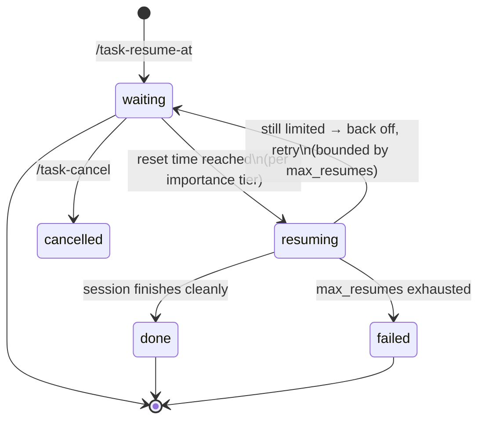

# claude-auto-resume

**Automatic recovery for Claude Code sessions that hit usage limits.**

When a long-running Claude Code task stops on a rate limit, claude-auto-resume
waits for the limit to reset and resumes the same session — automatically,
with context, and without you babysitting a terminal.


---

## Table of contents

- [Why](#why)
- [Key features](#key-features)
- [How it works](#how-it-works)
- [Quick start](#quick-start)
- [Command reference](#command-reference)
- [Documentation](#documentation)
- [Project status](#project-status)
- [Development](#development)
- [Limitations](#limitations)
- [License](#license)

## Why

Long agentic tasks regularly outlive a usage window. When the limit hits,
the session dies mid-task and you wait — checking back every so often so you
can type "continue" the moment the limit resets. This tool removes that
loop: schedule once, walk away, come back to a finished task.

## Key features

| Feature | Description |
|---|---|
| **Post-limit scheduling** | Already hit the limit? `/task-resume-at 20:00` schedules the resume — no pre-registration needed. |
| **Importance tiers** | `critical` resumes with no questions asked, `normal` gives you a 60-second window to object, `low` just notifies you. |
| **Suspend-safe waiting** | The daemon wakes every 60 s and compares wall-clock time, so a closed laptop lid doesn't break the schedule. |
| **Context-aware resume** | Resume prompts point the session at your `PROGRESS.md` so it picks up where it left off. |
| **Safety rails** | Bounded retries (`max_resumes`), exponential-style backoff when a resume bounces off a still-active limit, cancel at any time, no dangerous permission flags unless you opt in. |
| **Editor-agnostic** | It's a Claude Code plugin: works from a terminal, SSH, JetBrains, or VS Code. A dedicated VS Code UI is planned. |

## How it works



1. **You schedule** a resume for the current workspace — typically right
   after seeing the limit message: `/task-resume-at 2h30m`.
2. **A detached daemon** starts and sleeps in 60-second ticks until the
   reset time. It re-reads state every tick, so cancelling or rescheduling
   takes effect within a minute.
3. **At reset time** it acts per the importance tier, then resumes the
   session headlessly: `claude --resume <session_id> -p "<resume prompt>"`.
4. **If the resume bounces** (limit not actually reset yet), it backs off
   and retries — at most `max_resumes` times — then reports honestly.

Everything the daemon knows lives in one file,
`~/.claude/auto-resume/state.json`, which is also the contract any UI
(status bar, future VS Code extension) reads. Actions and outcomes are
journaled per task; `/task-status` shows the timeline.

## Quick start

Requires Claude Code with plugin support, bash, and macOS or Linux
(`jq` recommended but not required).

```text
# inside Claude Code, from this repository's clone or GitHub:
/plugin marketplace add 0xsaju/claude-auto-resume
/plugin install claude-auto-resume@auto-resume
```

Then, the day a limit hits you mid-task:

```text
/task-resume-at 20:00        # resume when your window resets at 20:00
/task-status                 # watch it
/task-cancel                 # changed your mind
```

Or track a task up front so it carries an importance tier:

```text
/task-start critical Migrate the billing service to the new API
```

Full walkthroughs, configuration, and troubleshooting: see the
**[User Guide](docs/USER-GUIDE.md)**.

## Command reference

| Command | What it does |
|---|---|
| `/task-resume-at <when> [tier]` | Schedule an auto-resume for this workspace. `<when>` accepts `20:00`, `2h30m`, `45m`, full ISO-8601, or `now`. |
| `/task-start <tier> <prompt>` | Track this workspace as a resumable task (`critical` \| `normal` \| `low`). |
| `/task-status` | Show status, resume schedule, attempt count, and recent journal. |
| `/task-cancel` | Cancel tracking; any pending auto-resume stands down within one tick. |

## Documentation

| Document | Audience |
|---|---|
| [User Guide](docs/USER-GUIDE.md) | Installing, using, configuring, troubleshooting |
| [Architecture](docs/ARCHITECTURE.md) | Design: components, state contract, lifecycle |
| [Decisions](docs/DECISIONS.md) | Append-only engineering decision log |
| [Hook Findings](docs/HOOK-FINDINGS.md) | Measured hook behavior at limit hits (drives detection) |

## Project status

**Alpha.** Manual scheduling is fully functional; automatic detection is
deliberately unimplemented until measured.

| Capability | Status |
|---|---|
| Manual post-limit scheduling (`/task-resume-at`) | ✅ Implemented, tested |
| Resume daemon (tiers, backoff, safety rails) | ✅ Implemented, tested |
| Task tracking + journal (`/task-start`, `/task-status`, `/task-cancel`) | ✅ Implemented, tested |
| **Automatic** limit detection via hooks | 🔬 Blocked on probe data — see below |
| Resume-verification fallback prompt | 🕐 Planned |
| `/warmup` window scheduler | 🕐 Planned |
| VS Code cockpit | 🕐 Planned |

Automatic detection is built strictly against *measured* hook behavior, not
guesses: the `claude-limit-hook-probe/` instrumentation plugin captures what
Claude Code actually emits at a limit hit, results land in
[docs/HOOK-FINDINGS.md](docs/HOOK-FINDINGS.md), and the detection code cites
them. Until then, the manual `/task-resume-at` flow covers the same need
with you as the detector.

## Development

```sh
bash test/run-tests.sh
```

119 shell tests: the state library against three JSON engines (`jq`,
`python3`, pure `awk`/`sed`), cross-engine interop, time parsing, the
daemon's full lifecycle (clean resume, backoff, tier behavior, cancel,
caps), and hook smoke tests. All iterative testing runs against
`test/fake-claude.sh` — a stub that mimics the claude CLI — so development
never spends real quota.

```text
plugin/                  the Claude Code plugin
├── .claude-plugin/      manifest
├── hooks/               Stop/SessionEnd wiring (detection entry point)
├── commands/            slash commands
└── scripts/             lib.sh · daemon.sh · task-*.sh · on-stop.sh
test/                    fake-claude stub + test suite
docs/                    user guide, architecture, decisions, findings
claude-limit-hook-probe/ throwaway hook-instrumentation plugin
vscode-extension/        future UI (empty)
```

Engineering ground rules live in [CLAUDE.md](CLAUDE.md): portable bash
(BSD + GNU), no hard `jq` dependency, hooks always exit 0 fast, atomic
state writes, real quota only for milestone verification.

## Limitations

Stated plainly, because tools that manage your quota shouldn't oversell:

- **Weekly caps are untouchable.** Scheduling and warm-up tricks help the
  5-hour rolling window only. Nothing can resume you past a weekly cap.
- **Resuming spends quota immediately at reset.** That's the point — but
  use `critical` deliberately.
- **Windows** is best-effort via Git Bash/WSL; desktop notifications there
  are currently log-only.
- **Session identity**: if a task wasn't tracked before the limit hit, the
  resumed run starts from your workspace's `PROGRESS.md` context rather
  than `--resume`-ing the exact session (session id capture via hooks
  arrives with detection).

## License

[MIT](LICENSE).
