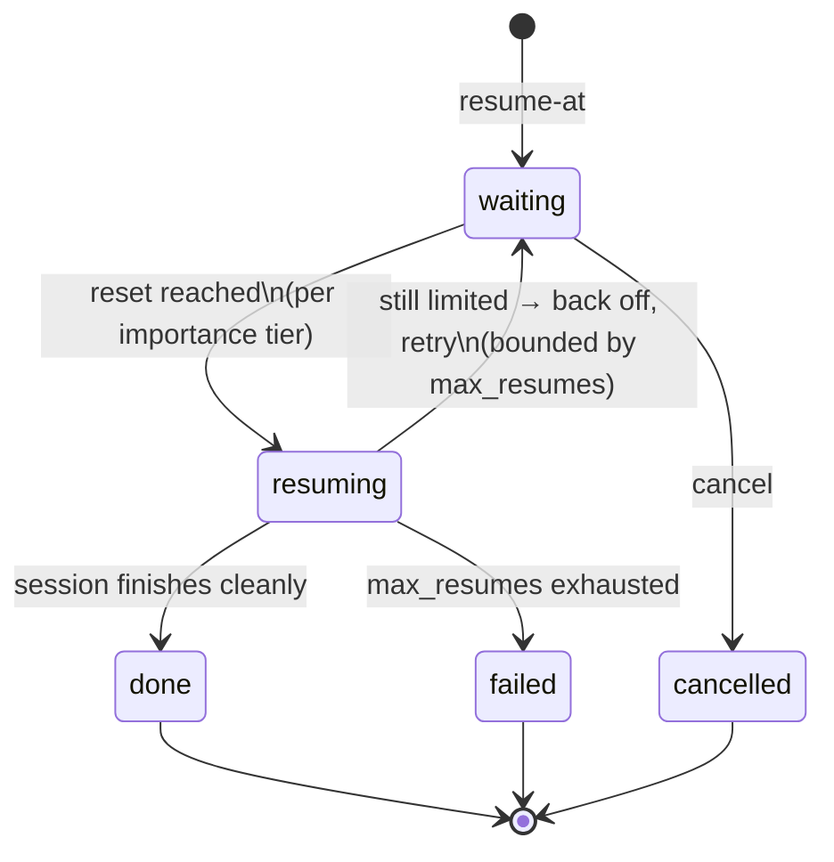

<div align="center">

# claude-auto-resume

**Your Claude Code task hit a usage limit at 2 AM. It finished anyway.**

Auto-resume for Claude Code: detects when the limit lifts, resumes your
session with context, and never makes you babysit a terminal again.


[Install](#installation) · [Quick start](#quick-start) ·
[Commands](#commands) · [How it works](#how-it-works) ·
[Docs](#documentation) · [Contributing](#contributing)

</div>

---

```text
$ claude
  … ✗ You've hit your session limit · resets 4:10pm (Asia/Dhaka)

$ claude-auto-resume resume-at
  Resume scheduled.
    workspace  : ~/projects/my-app
    resume at  : auto-detect (probing every 30 min until the limit lifts)
    session    : 612fb08b — the original conversation continues (claude --resume)
    importance : critical
    daemon     : running detached, wakes every 60s

$ # …close the laptop lid. Walk away.
  # At reset: desktop notification → YOUR session picks up where it stopped.
```

## Why

Long agentic tasks regularly outlive a usage window. When the limit hits,
the session dies mid-task — and you check back every twenty minutes so you
can type "continue" the moment it resets. That's an alarm clock job, not a
developer job. claude-auto-resume takes the shift for you: one command
after the limit hits (soon: zero commands), and the task resumes itself
the moment resuming is possible.

## Features

| | |
|---|---|
| **True session resume** | The interrupted **conversation itself** continues (`claude --resume <session-id>`) — not a fresh chat. The newest session is pinned automatically; `claude-auto-resume sessions` lists them, `--session` picks another, and the VS Code cockpit shows them as one-click plates. |
| **Automatic reset detection** | `claude-auto-resume resume-at` — one probe reads the reset time straight out of the limit message and schedules the resume for exactly that moment. No time to look up, nothing to type twice. |
| **Works when nothing else does** | The CLI costs zero tokens and needs no model turn — it works *while you're rate-limited*, which is precisely when you need it. |
| **Importance tiers** | `critical` resumes silently, `normal` gives you a 60-second window to object, `low` only notifies. |
| **Suspend-safe** | The daemon compares wall-clock time on 60-second ticks — a closed lid delays nothing. |
| **Context-aware resume** | Resumed sessions are pointed at your `PROGRESS.md`, so they continue instead of starting over. |
| **Safety rails** | Bounded retries, backoff when a resume bounces off a still-active limit, instant cancel (kills in-flight work), no dangerous permission flags unless you opt in. |
| **Honest by design** | Detection is built from *measured* behavior, never guessed message formats. Weekly caps can't be beaten, and the docs say so. |

## Installation

One command — no root, no dependencies beyond bash (`jq` recommended,
`python3` used if present):

```sh
curl -fsSL https://raw.githubusercontent.com/0xsaju/claude-auto-resume/main/install.sh | bash
```

This is the **complete** setup: the CLI lands on your PATH
(`~/.local/bin`), the engine in `~/.claude-auto-resume`, and the Claude
Code detection hooks are registered — merged carefully and reversibly into
`~/.claude/settings.json`, with a timestamped backup first.

The tool manages itself from then on:

```sh
claude-auto-resume update       # pull the latest version
claude-auto-resume doctor       # verify the whole environment
claude-auto-resume uninstall    # remove cleanly (keeps your task state)
```

> **Windows**: best-effort via WSL/Git Bash for now; native support
> (Task Scheduler) is on the roadmap.

## Quick start

The day a limit interrupts you:

```sh
cd ~/projects/my-app
claude-auto-resume resume-at          # auto-detect the reset, resume, done
```

Prefer an exact time, or want to watch?

```sh
claude-auto-resume resume-at 20:00    # resume precisely at 20:00
claude-auto-resume status             # task state, attempts, journal
claude-auto-resume watch              # follow the daemon log live
claude-auto-resume cancel             # stop everything, immediately
```

Track a long task up front so it carries an importance tier:

```sh
claude-auto-resume start critical "Migrate the billing service to the new API"
```

Tip: `alias car='claude-auto-resume'`.

## Commands

| Command | Description |
|---|---|
| `resume-at [when] [tier] [--session …] [--prompt …] [--workspace …]` | Schedule an auto-resume. No `when` = auto-detect the reset. Accepts `auto`, `20:00`, `2h30m`, `45m`, ISO-8601, `now`. `--session <n\|id\|latest\|new>` picks the conversation to continue (default: newest); `--prompt` sets the message the resumed session receives; `--workspace` targets another project. |
| `sessions [--workspace <path>]` | List a workspace's Claude Code sessions — pick which one resumes. |
| `start <tier> <description>` | Track this workspace (`critical` \| `normal` \| `low`). |
| `status` | Task state, tier, attempts, resume time, journal. *(default)* |
| `list` | All tracked workspaces. |
| `cancel` | Stop now: daemon and any in-flight resume are killed. |
| `log [n]` / `watch` | Show / follow the log. |
| `doctor` | Full environment self-check. |
| `setup-hooks` / `remove-hooks` | (De)register the detection hooks — the installer already did this. |
| `update` / `uninstall` / `version` | Tool management. |

Full reference with examples: **[User Guide](docs/USER-GUIDE.md)**.

## How it works



1. **Schedule** — `resume-at` records the task in
   `~/.claude/auto-resume/state.json` and spawns a small detached daemon.
2. **Wait** — the daemon wakes every 60 seconds, re-reads state (so cancel
   and reschedule always take effect), and compares wall-clock time.
   Each tick is a few local file reads: zero tokens, zero network.
3. **Detect** — in auto mode it fires one minimal `haiku` probe. Still
   limited? The limit message itself announces the reset time
   (`…resets 4:10pm (Asia/Dhaka)` — a format we measured, not guessed);
   the daemon parses it and waits for exactly that moment.
4. **Resume** — `claude --resume <session> -p "…Check PROGRESS.md first"`
   runs headlessly. Success → `done`. A bounce off a still-active limit →
   back off and retry, at most `max_resumes` times, then report honestly.

Everything the daemon knows lives in one human-readable file —
`state.json` — which is also the contract every UI reads. One engine, many
front doors:

```text
bin/claude-auto-resume    the CLI — primary interface
plugin/scripts/           the engine: state, daemon, hooks, time parsing
plugin/hooks/             the same hooks as a Claude Code plugin (alternative)
vscode-extension/         status-bar cockpit for VS Code (MVP)
test/                     fake-claude stub + 200-test suite
docs/                     user guide · architecture · decision log · findings
```

## Detection is measured, never guessed

The exact payloads Claude Code emits at a limit hit are undocumented.
Code built on guessed formats fails silently at the worst possible moment
— so this project refuses to guess. Every registered hook records real
payloads to `~/.claude/auto-resume/logs/hook-payloads.log`; detection
logic is only written against what's documented in
[HOOK-FINDINGS.md](docs/HOOK-FINDINGS.md), and cites it. The measured
stdout format already powers reset-time parsing; hook-payload findings
will unlock the endgame — **zero-typing detection**: limit hits, hooks
fire, daemon schedules itself, you were never involved.

## Project status

**Alpha** — the manual and semi-automatic flows are complete and tested;
full automation awaits real-world hook data.

| Capability | Status |
|---|---|
| True session resume (`--resume`, session picker in CLI + cockpit) | ✅ |
| Auto reset detection (probe + measured message parsing) | ✅ |
| Scheduled resume at a known time | ✅ |
| Resume daemon: tiers, backoff, caps, instant cancel | ✅ |
| Task tracking, journal, multi-workspace `list` | ✅ |
| One-command install incl. hook registration | ✅ |
| Full CLI tool surface (update/uninstall/doctor/…) | ✅ |
| VS Code cockpit | 🧪 MVP, run from source |
| Hook-based zero-typing detection | 🔬 Awaiting measured payloads |
| `/warmup` window scheduler · stuck detection · resume verification | 🕐 Planned |
| Native Windows (Task Scheduler) · reboot-surviving schedules | 🕐 Planned |

## Development

```sh
git clone https://github.com/0xsaju/claude-auto-resume
cd claude-auto-resume
bash test/run-tests.sh        # 200 tests, no real quota ever spent
```

The suite exercises the state library across three JSON engines (`jq`,
`python3`, pure `awk`/`sed`), the daemon's full lifecycle, auto-detection
against a mode-switchable fake claude, hook registration against fixture
settings files, and the installer end-to-end. Ground rules live in
[CLAUDE.md](CLAUDE.md); every non-obvious decision is logged in
[DECISIONS.md](docs/DECISIONS.md).

## Documentation

| Document | What's in it |
|---|---|
| [User Guide](docs/USER-GUIDE.md) | Install, workflows, full command & config reference, troubleshooting, FAQ |
| [Architecture](docs/ARCHITECTURE.md) | Components, state contract, lifecycle, design constraints |
| [Decision Log](docs/DECISIONS.md) | Append-only: every decision, dated, with reasoning (D1–D22) |
| [Hook Findings](docs/HOOK-FINDINGS.md) | Measured limit-hit behavior — the source of truth for detection |
| [Contributing](CONTRIBUTING.md) | Dev setup, testing rules, how to donate limit-hit captures |

## Contributing

Contributions are welcome — see **[CONTRIBUTING.md](CONTRIBUTING.md)**.
The single most valuable contribution right now needs no code at all: if
you hit a usage limit with the hooks installed, a sanitized excerpt of
your `hook-payloads.log` directly unblocks automatic detection for
everyone.

## Limitations

Stated plainly, because a tool that manages your quota shouldn't oversell:

- **Weekly caps are untouchable.** Everything here helps the rolling
  window only; nothing resumes you past a weekly cap (auto mode detects
  this case and tells you instead of probing forever).
- **Resuming spends quota the moment it resets** — that's the point, but
  choose `critical` deliberately.
- **Headless resumes need pre-approved permissions** to edit files;
  configure an allowlist (User Guide §6). The tool never adds
  `--dangerously-skip-permissions` for you.
- **Daemons don't survive reboots** yet (roadmap: OS-level one-shots).

## License

[MIT](LICENSE) © claude-auto-resume authors
