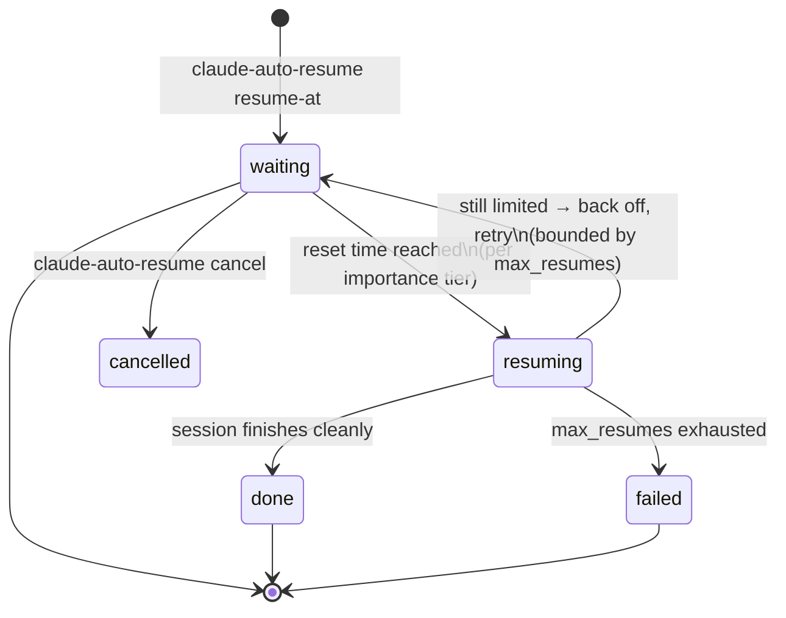

# claude-auto-resume

**Automatic recovery for Claude Code sessions that hit usage limits.**

When a long-running Claude Code task stops on a rate limit, claude-auto-resume
waits for the limit to reset and resumes the same session — automatically,
with context, and without you babysitting a terminal.


---

## Table of contents

- [Why](#why)
- [Key features](#key-features)
- [How it works](#how-it-works)
- [Quick start](#quick-start)
- [Command reference](#command-reference)
- [Documentation](#documentation)
- [Project status](#project-status)
- [Development](#development)
- [Limitations](#limitations)
- [License](#license)

## Why

Long agentic tasks regularly outlive a usage window. When the limit hits,
the session dies mid-task and you wait — checking back every so often so you
can type "continue" the moment the limit resets. This tool removes that
loop: schedule once, walk away, come back to a finished task.

## Key features

| Feature | Description |
|---|---|
| **Automatic reset detection** | Just run `claude-auto-resume resume-at` — the daemon probes once, reads the reset time straight out of the limit message, and resumes at exactly that moment. No reset time to look up. |
| **Post-limit scheduling** | Know the reset time? `claude-auto-resume resume-at 20:00` resumes exactly then — no probing, no pre-registration needed. |
| **Importance tiers** | `critical` resumes with no questions asked, `normal` gives you a 60-second window to object, `low` just notifies you. |
| **Suspend-safe waiting** | The daemon wakes every 60 s and compares wall-clock time, so a closed laptop lid doesn't break the schedule. |
| **Context-aware resume** | Resume prompts point the session at your `PROGRESS.md` so it picks up where it left off. |
| **Safety rails** | Bounded retries (`max_resumes`), exponential-style backoff when a resume bounces off a still-active limit, cancel at any time, no dangerous permission flags unless you opt in. |
| **CLI-first, editor-agnostic** | A zero-token terminal CLI that works even while rate-limited, wherever you run Claude Code — terminal, SSH, JetBrains, VS Code. A small plugin adds detection hooks; a VS Code UI is planned. |

## How it works



1. **You schedule** a resume for the current workspace — typically right
   after seeing the limit message: `claude-auto-resume resume-at 2h30m`.
2. **A detached daemon** starts and sleeps in 60-second ticks until the
   reset time. It re-reads state every tick, so cancelling or rescheduling
   takes effect within a minute.
3. **At reset time** it acts per the importance tier, then resumes the
   session headlessly: `claude --resume <session_id> -p "<resume prompt>"`.
4. **If the resume bounces** (limit not actually reset yet), it backs off
   and retries — at most `max_resumes` times — then reports honestly.

Everything the daemon knows lives in one file,
`~/.claude/auto-resume/state.json`, which is also the contract any UI
(status bar, future VS Code extension) reads. Actions and outcomes are
journaled per task; `claude-auto-resume status` shows the timeline.

## Quick start

Requires bash and macOS or Linux (`jq` recommended but not required;
Windows via WSL/Git Bash is best-effort for now).

**Install with one command** (no root; puts the repo in
`~/.claude-auto-resume` and the CLI on `~/.local/bin`):

```sh
curl -fsSL https://raw.githubusercontent.com/0xsaju/claude-auto-resume/main/install.sh | bash
```

Optionally install the plugin part — its only job is the hooks that will
provide fully automatic limit detection (in development) — inside Claude
Code:

```text
/plugin marketplace add ~/.claude-auto-resume
/plugin install claude-auto-resume@auto-resume
```

The CLI is deliberately the primary interface: it costs zero tokens and
works **while you're rate-limited** — the one moment when nothing that
needs a model turn can run.

Then, the day a limit hits you mid-task:

```sh
cd ~/my/project
claude-auto-resume resume-at    # auto-detect the reset and resume
claude-auto-resume status       # watch it
claude-auto-resume cancel       # changed your mind
```

Or track a task up front so it carries an importance tier:

```sh
claude-auto-resume start critical "Migrate the billing service to the new API"
```

Full walkthroughs, configuration, and troubleshooting: see the
**[User Guide](docs/USER-GUIDE.md)**.

## Command reference

All commands operate on the current directory's task (alias suggestion:
`alias car='claude-auto-resume'`).

| Command | What it does |
|---|---|
| `resume-at [when] [tier]` | Schedule an auto-resume. No `when` = auto-detect the reset. Accepts `auto`, `20:00`, `2h30m`, `45m`, ISO-8601, `now`. |
| `start <tier> <description>` | Track this workspace as a resumable task (`critical` \| `normal` \| `low`). |
| `status` | Show status, schedule, attempts, recent journal. (Default when no command given.) |
| `cancel` | Cancel; a pending resume stands down within one tick. |
| `log [n]` / `watch` | Show / follow the daemon log. |

## Documentation

| Document | Audience |
|---|---|
| [User Guide](docs/USER-GUIDE.md) | Installing, using, configuring, troubleshooting |
| [Architecture](docs/ARCHITECTURE.md) | Design: components, state contract, lifecycle |
| [Decisions](docs/DECISIONS.md) | Append-only engineering decision log |
| [Hook Findings](docs/HOOK-FINDINGS.md) | Measured hook behavior at limit hits (drives detection) |

## Project status

**Alpha.** Manual scheduling is fully functional; automatic detection is
deliberately unimplemented until measured.

| Capability | Status |
|---|---|
| Automatic reset detection (probe-based, `claude-auto-resume resume-at`) | ✅ Implemented, tested |
| Reset-time parsing from the limit message (measured format, F1) | ✅ Implemented, tested |
| Scheduled resume at a known time (`claude-auto-resume resume-at 20:00`) | ✅ Implemented, tested |
| Resume daemon (tiers, backoff, safety rails) | ✅ Implemented, tested |
| Task tracking + journal (`claude-auto-resume start`, `claude-auto-resume status`, `claude-auto-resume cancel`) | ✅ Implemented, tested |
| Instant limit detection via hooks (exact reset time, zero probe cost) | 🔬 Blocked on probe data — see below |
| One-command installer + zero-token terminal CLI | ✅ Implemented, tested |
| Resume-verification fallback prompt | 🕐 Planned |
| `/warmup` window scheduler | 🕐 Planned |
| VS Code cockpit (UI over state.json) | 🕐 Planned |
| Native Windows (Task Scheduler instead of the daemon; also enables reboot-surviving schedules everywhere) | 🕐 Planned |

Auto-detection works by *probing*: a minimal `claude -p "ok" --model
haiku` call fails while the limit is active. The limit message's format has
been measured on a real limited account
(`You've hit your session limit · resets 4:10pm (Asia/Dhaka)` — recorded as
F1 in [docs/HOOK-FINDINGS.md](docs/HOOK-FINDINGS.md)), so the daemon reads
the announced reset time from the first failed probe and waits for exactly
that moment; if the message can't be parsed, it falls back to polling every
30 minutes. Exit codes are never trusted alone — a resume whose output
contains the limit message is treated as a failed attempt even if the CLI
exits 0. Hook-based detection (catching the limit the instant it hits,
with the session id, no probe at all) still awaits hook-payload probe data
from `claude-limit-hook-probe/`.

## Development

```sh
bash test/run-tests.sh
```

119 shell tests: the state library against three JSON engines (`jq`,
`python3`, pure `awk`/`sed`), cross-engine interop, time parsing, the
daemon's full lifecycle (clean resume, backoff, tier behavior, cancel,
caps), and hook smoke tests. All iterative testing runs against
`test/fake-claude.sh` — a stub that mimics the claude CLI — so development
never spends real quota.

```text
bin/                     the terminal CLI (primary interface)
install.sh               curl-pipe-bash installer
plugin/                  Claude Code plugin — the detection sensor
├── .claude-plugin/      manifest
├── hooks/               Stop/SessionEnd wiring (detection entry point)
└── scripts/             lib.sh · daemon.sh · task-*.sh · on-stop.sh
test/                    fake-claude stub + test suite
docs/                    user guide, architecture, decisions, findings
claude-limit-hook-probe/ throwaway hook-instrumentation plugin
vscode-extension/        future UI (empty)
```

Engineering ground rules live in [CLAUDE.md](CLAUDE.md): portable bash
(BSD + GNU), no hard `jq` dependency, hooks always exit 0 fast, atomic
state writes, real quota only for milestone verification.

## Limitations

Stated plainly, because tools that manage your quota shouldn't oversell:

- **Weekly caps are untouchable.** Scheduling and warm-up tricks help the
  5-hour rolling window only. Nothing can resume you past a weekly cap.
- **Resuming spends quota immediately at reset.** That's the point — but
  use `critical` deliberately.
- **Windows** is best-effort via Git Bash/WSL; desktop notifications there
  are currently log-only.
- **Session identity**: if a task wasn't tracked before the limit hit, the
  resumed run starts from your workspace's `PROGRESS.md` context rather
  than `--resume`-ing the exact session (session id capture via hooks
  arrives with detection).

## License

[MIT](LICENSE).
